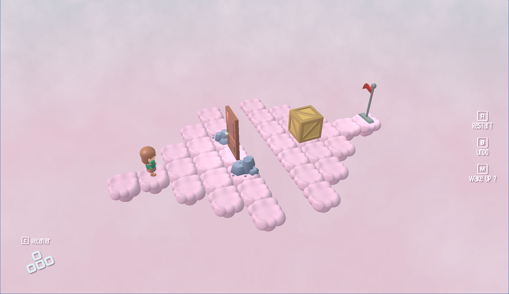

# Another Dream

Vous voici dans un monde onirique, où vous devrez vous créer un chemin pour parvenir à avancer, en poussant des caisses et en faisant fonctionner vos méninges. Attention, le monde onirique est instable, et la frontière avec le cauchemar est très fine. Saurez-vous en tirer partie pour progresser dans les niveaux ?

 

## Dépendances

* Node.js : Environnement backend et dépendances du projet
* TypeScript : Meilleure gestion des types et facilitant le développement à grande échelle
* Parcel : Un bundler rapide et zéro-config pour compiler le code et gérer les assets
* Babylon.js : Gestion de la 3D et des rendus graphiques en temps réel

## Comment y jouer ?

Le jeu est hébergé pendant toute la durée du concours à l'adresse [https://vps111999.serveur-vps.net](https://vps111999.serveur-vps.net). Ce lien permet de jouer directement dans votre navigateur, sans installation. Par la suite, il sera déposé sur la plateforme gratuite [itch.io](https://itch.io), afin de le rendre accessible à un plus grand nombre. Pour plus d'informations sur le fonctionnement du jeu, n'hésitez pas à vous reporter au fichier [DOCS.md](https://github.com/paradoxe-tech/another-dream/blob/main/DOCS.md) de ce dépôt, de préférence après avoir joué au jeu pour profiter au maximum de l'immersion !

Nous sommes également en train de rendre le jeu responsive, afin de permettre aux utilisateurs sur téléphones et tablettes d'en profiter également.

## Contenus additionnels

Deux vidéos de présentation sont disponibles :
- [Un trailer](
https://vps111999.serveur-vps.net/trailer1), qui présente le jeu en adoptant un style promotionnel ;
- et [une vidéo plus technique](https://vps111999.serveur-vps.net/trailer2), qui se focalise davantage sur la décomposition du gameplay et de l'interface du jeu, en rentrant plus dans les détails.

## Crédits 

Ce jeu a été réalisé par Florian Durand ([@poussezvousjarrive](https://github.com/poussezvousjarrive)), Eloi Rathgeber-Kivits ([@greensunsmash](https://github.com/greensunsmash)) et Mathéo Tripnaux-Moreau ([@paradoxe-tech](https://github.com/paradoxe-tech)), étudiants en deuxième année de Licence d'Informatique à l'Université Côte d'Azur, dans le cadre de l'édition 2025 du concours [Games On Web](https://github.com/gamesonweb) sur le thème "Dreamland". [Le dépôt original du jeu est disponible ici.](https://github.com/paradoxe-tech/another-dream)

Tous les contenus (assets, textures, audios) utilisés sont libres de droit, provenant en majorité de [Kay Lousberg](kaylousberg.com), [kenney.nl](kenney.nl), [dorkling](https://dorkling.itch.io/) (les assets provenant de ce dernier étant grandement modifiés) et de Florian Durand. Le code du projet est disponible sous la licence détaillée dans le fichier approprié.